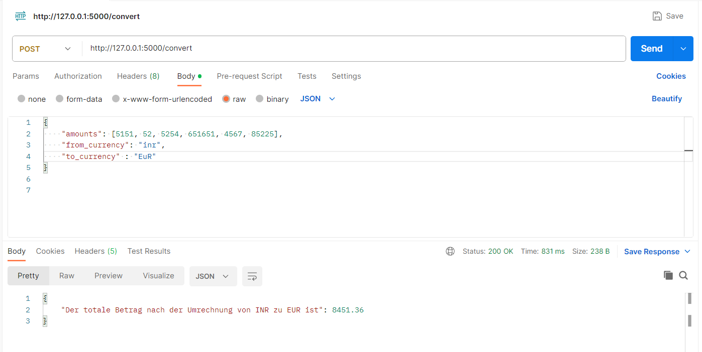

# currencyConverter

This application is a currency Converter. You can have an overview of the currencies
here: https://v6.exchangerate-api.com/v6/ee4cd4fcf90316edf094a734/latest/USD .

It takes the exchange rates from an Open API (https://www.exchangerate-api.com/). Here is a manual how to test it:

To test it you can use Postman.

1. Navigate to PostMan and paste the URL which is given when you run the code.
2. Change the CRUD function to "POST"
3. The URL should be: "YOURURL/convert"
4. Send the JSON with the test data in the body. Example:
   {
   "amounts": [8451, 51165, 755569],
   "from_currency": "aud",
   "to_currency" : "JYP"
   }
5. Send the request. It should deliver the total sum converted in the currency you would like.

### Expected Result

